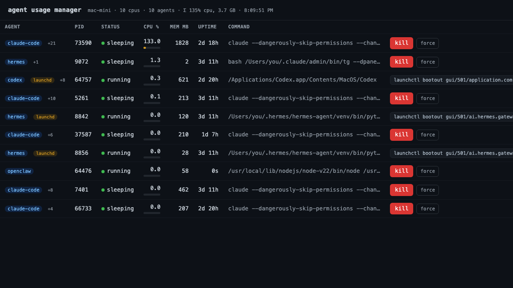

# agent-usage-manager

A small web dashboard for **headless AI agents** running on a machine —
OpenClaw, Hermes, Claude Code, Ollama, vLLM, llama.cpp, or anything you name. It
shows which agents are alive and what they're costing you (CPU, memory, GPU), and
gives you a **kill button** per agent. Think `htop`, scoped to just your agents —
the [screenshot below](docs/dashboard.png) is a real run on a fleet node.

No database, no auth framework (one static token file gates the kill switch),
four direct dependencies (FastAPI, uvicorn, psutil, PyYAML). Runs on macOS and Linux. It is a
per-node monitor and guarded local control panel: fleet schedulers may consume
its read-only telemetry, but should own their own scheduling and actuation.



*A real run: ten agents grouped by process tree (`+N` = children rolled up),
per-agent CPU/memory/uptime, launchd-supervised jobs flagged, and a kill button
per row.*

```
AGENT          PID    STATUS     CPU %   MEM MB   GPU MB   UPTIME   COMMAND          ┆
openclaw +3    48213  ● running    62.4    1840     7320     2h 11m  openclaw serve … [kill] [force]
claude-code +9 73590  ● running    97.4    7630        —     1h 02m  claude --chann … [kill] [force]
hermes         49001  ● running    18.0     512        —     44m     hermes worker …  [kill] [force]
ollama         50122  ● running     3.1    9210    14080     6h 02m  ollama runner …  [kill] [force]
```
(`+N` = child processes rolled up under the agent; CPU/mem/GPU are tree totals.)

> The schematic above shows the GPU column (NVIDIA only); the screenshot is a real
> run on Apple Silicon, where per-process GPU stats aren't available so that column
> is hidden. The UI auto-refreshes every 3s.

## What it does

- **One row per agent.** Agents are grouped by process tree — the spawned children
  of an agent (inference subprocesses, MCP servers, helpers) are rolled up under it
  with a `+N` badge instead of cluttering the list as separate rows.
- **Liveness** — green dot = running, red = zombie/dead. Status column shows the OS state.
- **Usage** — CPU %, resident memory (MB), GPU memory (MB, NVIDIA only), and uptime,
  refreshed every 3s. **CPU/mem/GPU are tree totals** — the agent's true cost including
  everything it spawned.
- **Kill the tree** — `kill` sends SIGTERM to the agent *and its children* (so spawned
  helpers don't leak resources), `force` sends SIGKILL. SIGTERM auto-escalates to
  SIGKILL after 3s. The confirm dialog tells you how many child processes will stop.
- **Trends, not just snapshots.** Each row has a CPU sparkline (last ~20 min, sampled
  in the background even with no browser open), plus a **`hot 5m+`** badge when an
  agent has been pegged ≥90% CPU for 5+ minutes, an **`idle 10m+`** badge when a
  long-running agent has done nothing for 10+ minutes, and a **`churn ×N`** badge when
  the same agent has died young 3+ times in 10 minutes — the states worth investigating
  (runaway, possibly wedged, crash-looping under a supervisor). Churn is what hot/idle
  can't see: a crash-looping process is a fresh pid every poll, so no per-process
  window ever fills. A **`leak?`** badge fires when an agent's memory ratchets up
  ≥30% (and ≥128 MB) over 15 minutes without coming back down.
- **Alerts.** A dashboard only helps while you're looking at it. Add an `alerts:`
  block to `agents.yaml` and any badge appearing runs your command (desktop
  notification, Telegram bot, pager — anything) with the details in `$AUM_*` env
  vars. Fires once per transition with a cooldown, never from the `list` CLI.
  By default only `hot`/`churn`/`leak` alert — `idle` is the normal state of an
  agent fleet that waits for work, so it's opt-in.

  ```yaml
  alerts:
    command: 'terminal-notifier -title agents -message "$AUM_MSG"'
    cooldown: 600
    flags: [hot, churn, leak]   # the default; add idle to opt in
    leak_floor_mb: 1536         # optional: leak alerts only above this RSS
  ```

  `leak_floor_mb` mutes leak *alerts* (the badge still shows) until the agent's
  absolute footprint crosses the floor — agents that accrue working state, like
  a chat bot growing its session context, ratchet RSS exactly like leakers, so
  relative growth alone can be noisy. Crossing the floor counts as the
  appearance, so a genuine ratchet still alerts.
- **Prometheus `/metrics`.** Per-agent CPU/mem/instances/restarts and badge states
  in text exposition format, aggregated per label (no pid-churn series bloat) —
  point Grafana or any Prometheus scraper at `http://127.0.0.1:8765/metrics`.
- **Expand the tree.** Click the `+N` badge to unfold an agent's child processes
  (per-child CPU/mem/command) — see what a kill would actually stop before clicking it.
- **Config hot-reload.** Edits to `agents.yaml` apply on the next poll, no restart.
  A broken edit keeps the last good config and shows the parse error in the header.
- **`list` subcommand.** `agent-usage-manager list` (or `list --json`) prints a one-shot
  table to stdout — no server, good for scripts and cron checks.
- **Kill-safe table.** Rows keep a stable order (sorted by label) and never reorder
  while your pointer is over the table, so the kill button can't shift under your
  cursor mid-click.

## Product boundary

`agent-usage-manager` is intentionally **not** a fleet scheduler, dispatcher, or
multi-host orchestrator. It answers local process questions: what agent process is
running here, what resources is its process tree using, did it enter a suspicious
state, and can this local operator safely stop it?

If you run a separate fleet control plane, treat AUM as an optional read-only
input. Scrape `list --json`, `/api/agents`, or `/metrics` for local OS facts, then
make scheduling, budget, restart, and kill/retire decisions in your own
deterministic control layer. Do not route irreversible fleet operations through
AUM's kill endpoint as a central substrate.

## Safety

This is the important part — a web page that can kill processes needs guardrails:

- **Allowlist only.** Only processes matching a pattern in `agents.yaml` are ever
  listed *or* killable. The kill endpoint re-checks the match server-side before
  sending any signal, so the dashboard can never be used to kill an arbitrary PID.
- **Protected patterns.** Anything matching `protect:` in `agents.yaml` — plus the
  monitor's own process and PID 1 — shows a disabled, greyed-out kill button and is
  refused server-side.
- **Secret redaction.** Command lines often carry tokens/keys in env vars or flags
  (`FOO_TOKEN=...`, `--api-key ...`, `sk-...`, `ghp_...`, JWTs). The command column
  redacts these to `***` before they ever reach the browser — safe to screenshot.
- **Browser guard (CSRF + DNS rebinding).** Binding to localhost doesn't keep
  browsers out — any web page you visit can `fetch()` a localhost port. Requests
  whose `Host` is a non-local DNS name are refused (DNS-rebinding guard), and a
  kill request carrying a foreign `Origin` is refused (CSRF guard) — so a
  malicious page can't kill your agents or read your process list. `curl` and
  the dashboard itself are unaffected.
- **Kill requires a token (caller authorization).** The allowlist above says what
  *may* be killed; the token says *who* may kill. The monitored agents are
  themselves untrusted HTTP callers — a prompt-injected agent with an HTTP tool
  and localhost reach could otherwise `POST /api/kill` and take down its
  siblings (Origin headers are trivially forged outside a browser). The token is
  auto-generated on first run into a `0600` file —
  `~/Library/Application Support/agent-usage-manager/kill_token` on macOS,
  `$XDG_STATE_HOME/agent-usage-manager/kill_token` (default
  `~/.local/state/…`) elsewhere — and every kill must send it as an
  `X-Kill-Token` header. It is **never served over HTTP** (anything that can
  curl the dashboard could read it): the dashboard asks you to paste it once on
  your first kill and keeps it in the browser's localStorage. Delete the file
  to rotate the token.
- **Action log.** Every kill attempt — success *and* every refusal — appends a
  JSON line to `actions.log` next to the token file: timestamp, caller address,
  target pid/command, outcome. "What was killed at 3am" and "what's been
  probing the kill endpoint" both have an answer. Append-only, no rotation;
  one line per attempt stays tiny.
- **Non-loopback binds fail closed.** It listens on `127.0.0.1`; asking it to
  bind anything else (`--host 0.0.0.0`, a LAN IP) refuses to start unless you
  also pass `--unsafe-expose`. Exposing the port means one static token is all
  that stands between the network and your agents — put real auth in front
  (reverse proxy + basic auth, SSH tunnel, etc.) before using that flag.

## Limits & known issues

- **Matching is a heuristic and it over-matches.** An agent's identity usually
  lives in its arguments (`node .../bin/codex`), and a GUI agent's real name is
  its `.app` bundle (Kiro launches a binary called `Electron`) — so the match
  target is the executable basename plus the first few args plus the bundle
  name. The cost is that anything living inside an agent's `.app` (updaters,
  crash handlers, helpers) and any process that names an agent in its first
  args (`tmux attach -t workspace-claude`) can be misclassified as that agent.
  `ignore:` is the escape hatch. The bundled list is not exhaustive and can't
  be — every new agent ships new helpers under its own name.
- **GPU column is NVIDIA-only.** Per-process GPU memory comes from
  `nvidia-smi --query-compute-apps` — NVIDIA compute processes (CUDA), in
  practice on Linux. AMD/Intel GPUs aren't read, graphics-only workloads don't
  appear, and Apple Silicon has no per-process GPU accounting API at all, so
  the column is hidden on Macs.
- **Supervision detection is launchd-only (macOS, user domain).** Root
  `LaunchDaemons` aren't flagged — that needs a privileged
  `launchctl print system/…`. On Linux, systemd-supervised services
  (`Restart=always`) aren't detected either, so killing one looks like it
  failed when systemd respawns it — use `systemctl stop` for those.
- **Same-user privileges only.** Signals are sent with the server's own
  privileges. Agents running as another user (or root) are listed, but a kill
  won't take (`killed: 0` in the response), and CPU/mem can read as 0 where
  the OS denies access.
- **History is in-memory.** Sparklines and the `hot`/`idle` flags (~20 min
  window) rebuild from scratch after a server restart.
- **Windows is untested.** Kill maps to `TerminateProcess` via psutil and may
  work, but CI covers Linux + macOS only.

## Quick start

**Recommended — one command, nothing to install first:**

```bash
uvx agent-usage-manager
# then open http://127.0.0.1:8765 (it also opens automatically)
```

`uvx` fetches and runs it in one step — no separate install, no virtualenv, no
leftovers. Don't have [`uv`](https://github.com/astral-sh/uv) yet? One line:

```bash
curl -LsSf https://astral.sh/uv/install.sh | sh      # macOS / Linux
# or: pip install uv
```

<details>
<summary>Other ways to install</summary>

```bash
pipx install agent-usage-manager     # clean isolated global CLI (needs pipx)

pip install agent-usage-manager      # universal; use inside a venv —
                                     # system Python may refuse with
                                     # "externally-managed-environment"
```

Then run `agent-usage-manager` (flags below).
</details>

From a clone (for hacking on it):

```bash
git clone <this-repo> && cd agent-usage-manager
./run.sh                           # venv + editable install, serves on :8765
```

It opens the dashboard in your browser automatically. Flags: `--host`, `--port`,
`--config /path/to/agents.yaml`, `--no-browser` (for headless/server use),
`--unsafe-expose` (required for any non-loopback `--host` — see
[Safety](#safety)).

## Configure which processes are "agents"

Edit `agents.yaml`:

```yaml
agents:
  - label: openclaw           # shown as the badge in the UI
    match: openclaw           # case-insensitive substring of the command line
  - label: hermes
    match: hermes
  - label: claude-code
    match: "claude(\\s|$|-code)"
    regex: true               # treat `match` as a regex instead of substring

protect:                      # matched + listed, but never killable
  - uvicorn

ignore:                       # never an agent: not listed, not killable
  - crashpad                  # incidental processes that share a name/bundle
  - shipit                    # path with a real agent (crash handlers,
  - kiro-cli-term             # auto-updaters, integrated-terminal shells, …)
```

A process matches if the pattern hits its **executable basename + first few
arguments** — deliberately not the whole command line, so a long embedded arg
(e.g. a system prompt mentioning "claude") can't misclassify a wrapper. On macOS
the outermost `.app` **bundle name** is also included, so GUI agents that launch
a generically-named binary (Kiro.app → `Electron`) are still matched by app name.

`protect:` keeps a matched process listed but refuses to kill it; `ignore:`
drops it from agent classification entirely.

**Telling identical agents apart (`tmux_labels:`)** — a fleet of same-binary
agents (say five `claude` bots, one per tmux session) all hits one `agents:`
entry and shows N indistinguishable rows; a distinguishing flag deeper in
their command lines is invisible to matching *by design* (see above). When
each instance runs in its own tmux session, the session name is its identity:

```yaml
tmux_labels: "^bot-(.+)$"   # session bot-coder_1 → row label coder_1
```

If a matched agent root (or an ancestor) is a tmux pane process whose session
name matches the regex, the row's label becomes the first capture group (the
whole session name if there's no group). Churn tracking, alert transitions,
and `/metrics` series all use the derived label, so each instance gets its own
state. Sessions that don't match the regex keep their `agents:` label, and the
key is ignored where tmux isn't installed or running.

**Which `agents.yaml` is used** — resolved once at startup, first hit wins:

1. `AGENTS_CONFIG=/path/to/agents.yaml` env var (the `--config` flag sets this)
2. `./agents.yaml` in the directory you launched from
3. the default bundled with the package

The dashboard header (and `list --json`) shows the resolved path, so you can
always see which file is live. Hot-reload watches that one file. An
`AGENTS_CONFIG` path that doesn't exist is an error at startup, not a silent
fallback.

## launchd-supervised agents (macOS)

Some agents run as **launchd services** (a `~/Library/LaunchAgents/*.plist`, or
anything started by `brew services`). If such a job sets `KeepAlive`, a signal
can't stop it: the process dies, launchd immediately respawns it under a new PID,
and the dashboard's "kill" looks like it silently failed.

The dashboard detects these (via `launchctl list`) and marks them with a
**`launchd`** badge. Instead of dead-end kill/force buttons it shows the command
that actually stops the job — click to copy:

```sh
launchctl bootout gui/<uid>/<label>            # stop now
launchctl disable gui/<uid>/<label>            # …and don't auto-start at login
```

The kill endpoint refuses signals for these jobs (HTTP 409) and returns the same
guidance, so the API never lies about a kill that won't stick. The message is
tailored to the job: `KeepAlive` jobs are told a signal won't stick at all;
`RunAtLoad`-only jobs are told a signal works now but the job restarts at next
login. *Limitation:* root `LaunchDaemons` aren't flagged — see
[Limits & known issues](#limits--known-issues).

## GPU notes

Per-process GPU memory comes from `nvidia-smi` when it's on `PATH` (Linux / NVIDIA).
**Apple Silicon has no per-process GPU accounting API**, so the GPU column stays blank
on Macs — CPU and memory are the meaningful resource signals there.

## API

- `GET  /api/agents` → `{ api_version, aum_version, agents: [...], host, cpu_count, mem_total_mb, mem_used_pct, config_path, config_error, ts }`
  — each agent includes read-only telemetry such as `pid`, `create_time`, `label`,
  resource totals, recent CPU `trend`, flags (`hot`, `idle`, `churn`, `leak` when
  present), protection state, and supervised-process guidance. Pair `pid` with
  `create_time` when caching rows so PID reuse cannot alias two different agents.
  This endpoint is suitable as an input to external tools, not as a fleet-control
  contract.
- `GET  /api/tree/{pid}` → the agent's process subtree (per-child pid/name/cpu/mem/cmdline);
  only works on recognized agents, same authorization as kill
- `POST /api/kill/{pid}?force=false` → SIGTERM (or SIGKILL with `force=true`).
  Requires the `X-Kill-Token` header — the token lives in the `0600` file shown
  in the 403 message (see [Safety](#safety)):

  ```bash
  curl -X POST -H "X-Kill-Token: $(cat ~/Library/Application\ Support/agent-usage-manager/kill_token)" \
    http://127.0.0.1:8765/api/kill/48213
  ```

## Run as a service

Linux (systemd), `~/.config/systemd/user/agent-usage-manager.service`:

```ini
[Unit]
Description=agent usage manager
[Service]
ExecStart=%h/agent-usage-manager/.venv/bin/uvicorn app:app --port 8765
WorkingDirectory=%h/agent-usage-manager
Restart=on-failure
[Install]
WantedBy=default.target
```

```bash
systemctl --user enable --now agent-usage-manager
```

## Development

```bash
git clone https://github.com/minglong51/agent-usage-manager && cd agent-usage-manager
pip install -e ".[dev]"
pytest -q
```

CI runs the test suite on Linux + macOS (Python 3.9 and 3.12) on every push and PR.
Cross-platform note: kill uses psutil's `terminate()`/`kill()`, which map to
SIGTERM/SIGKILL on POSIX and TerminateProcess on Windows.

## Release notes

### 0.2.4 — stop reporting non-agents

- `ignore:` now covers Sparkle's `Autoupdate`/`Updater` (Codex.app's equivalent of
  Squirrel's ShipIt), the "Codex for Chrome" extension host, and `tmux attach`
  clients — a session named `workspace-claude` matched the claude pattern via the
  `-t` argument.
- Dogfooded against `ps` on a live 10-agent fleet: 22 rows → 17, with all six
  removals confirmed as not agents and every real agent retained.

### 0.2.3 — startup fixes

- The browser now opens once the port actually accepts, instead of on a fixed
  1s timer. A cold `uvx` run outran the timer and landed on connection-refused.
- No more `/favicon.ico` 404.
- Dropped two inaccurate README claims ("single-file"; "no dependencies beyond
  FastAPI + psutil" — there are four).

### 0.2.2 — telemetry identity and fleet labels

- Added `api_version` and `aum_version` to `/api/agents` and `list --json`.
- Added per-agent `create_time` so external telemetry consumers can pair it with
  `pid` and avoid PID-reuse aliasing.
- Added `tmux_labels:` — derive per-instance row labels from tmux session names,
  so a fleet of identical agents stops rendering as N indistinguishable rows.

### 0.2.1 — security and verification hardening

- Kill endpoint now requires caller authorization via the static token file.
- Non-loopback binds fail closed unless `--unsafe-expose` is explicitly passed.
- Kill attempts and refusals append to the local action log.
- Added deterministic kill-path regression tests, including pid/create_time pins.
- Added synthetic hot/idle/churn/leak trace fixtures.
- Added adversarial matcher cases so lookalike process names stay test-covered.

## Troubleshooting

- **`pip install` fails building psutil** — no prebuilt wheel for your
  Python/platform, so pip compiles it: you need a C toolchain and Python
  headers (`xcode-select --install` on macOS; `apt install gcc python3-dev`
  on Debian/Ubuntu). Or skip the problem with `uvx agent-usage-manager`.
- **Dashboard is empty / "No matching agents running"** — first check which
  config was picked up (resolution order above; the header shows the resolved
  path). Then remember matching is against the executable basename + first few
  arguments, not the full command line — a pattern that only appears deep in
  the args won't match.
- **Kill "doesn't work" — the agent comes back under a new PID** — it's
  supervised. On macOS the row gets a `launchd` badge with the `launchctl
  bootout` command that actually stops it; on Linux, systemd services aren't
  detected (see limits) — `systemctl stop` them. A `killed: 0` in the kill
  response means nothing was actually signaled (e.g. the agent runs as
  another user).
- **HTTP 403 on every request** — the DNS-rebinding guard refuses non-local
  hostnames. Use `http://127.0.0.1:8765` (or a bare IP) instead of a custom
  DNS name pointing at the box.
- **HTTP 403 on kill only ("Kill requires the X-Kill-Token header")** — send
  the token from the file named in the message. In the dashboard, the paste
  prompt reappears on your next kill click (a stored stale token is forgotten
  automatically when the server rejects it).
- **"refusing to bind …" at startup** — non-loopback `--host` values fail
  closed; add `--unsafe-expose` only with auth in front (see
  [Safety](#safety)).

## License

MIT
